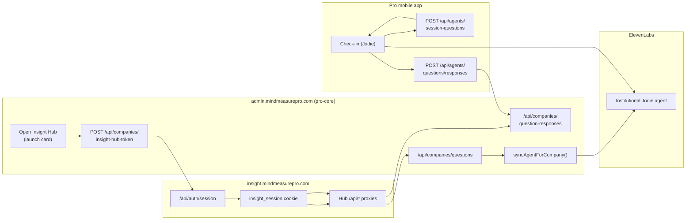

# Insight Hub

**Status**: Shipped on both product lines (Pro and University).
**Domains**: `insight.mindmeasurepro.com` (Pro), `insight.mindmeasure.co.uk` (University)
**Repos**: `mind-measure-pro-insight-hub` and `mind-measure-university-insight-hub` (standalone Next.js apps)
**Backends**: `mind-measure-pro-core` (`/api/companies/*`) and `mind-measure-core` (university Conversational Insight endpoints)

The Insight Hub is the standalone home for **Conversational Insight** — Mind Measure's mechanism for letting an institution ask its people natural-language questions that Jodie weaves into ordinary wellbeing check-ins, then reading back the answers as anonymised, aggregated themes, sentiment and cohort comparisons.

This section is the single source of truth for how the feature actually works. It is grounded in the shipped code, not the roadmap. The per-check-in resolver — which delivers each user a cohort-matched, never-repeated pair of questions via a dynamic-variable placeholder — is documented in full under [How Questions Are Asked](/insight-hub/asking-questions).

> **Related planning docs.** The forward-looking specs live under Planning: [Conversational Insight v2](/planning/conversational-insight-v2) (the design) and [Insight Hub](/planning/insight-hub) (the repositioning). This section documents what is **built and running**.

---

## What it is

Conversational Insight turns a wellbeing platform into a listening instrument. Instead of sending a survey, an institution adds a question — *"How is the move to the new office affecting you?"* — and Jodie finds a natural moment to raise it during check-ins. Answers are paraphrased by AI, stripped of identity, and surfaced as:

- **Themes** — what people are talking about, across one question or the whole library.
- **Sentiment** — positive / neutral / mixed / negative lean.
- **Cohort divergence** — where one part of the organisation feels differently from another.
- **Anonymised sample quotes** — never verbatim transcript; always Bedrock-paraphrased.

It only works because of the engaged network of people already using Mind Measure for wellbeing support. There is no separate survey audience — the insight is a by-product of conversations people are already having. That framing matters: it is **additional value for the organisation already paying for Mind Measure**, not a bolt-on survey tool.

---

## Why it has its own hub

Conversational Insight began life as a tab inside the company CMS. Functionally it worked; commercially it was invisible — buried in a settings page. The Insight Hub pulls it out into a dedicated, branded surface that an institution can recognise, demo, and point at on an invoice. It mirrors the pattern already proven by the Content Hub: click **Open Insight Hub** from admin, land in a focused workspace, do the work, come back.

Access is gated per organisation by a single boolean, `companies.conversational_insight_enabled`, set by a Mind Measure superuser. When off, the hub, its sidebar launch card, and its token endpoint all fail closed.

---

## The four surfaces

| Surface | Route | Purpose |
|---|---|---|
| **Home / Dashboard** | `/dashboard` | Headline insight, live questions, "Voice of the workforce" themes, cohort divergence heatmap, CSV export |
| **Questions** | `/questions` | Author, edit, publish, pause and archive questions with cohort targeting |
| **Cohort Compare** | `/cohorts` | Build 2–6 cohorts for a question and generate a printable AI insight report |
| **Archive** | `/archive` | Retired questions with lifetime aggregates and per-row CSV export |

Plus a per-question **deep dive** at `/responses/[id]` and a passwordless **front door** at `/login`. See [Hub Surfaces](/insight-hub/hub-surfaces) for what each renders.

---

## How the pieces fit together

The hub holds **no business logic**. Its API routes are thin, tenant-pinned proxies onto the Conversational Insight endpoints in pro-core. The actual question-asking happens in the mobile check-in via the institution's ElevenLabs Jodie agent; the actual aggregation happens in pro-core via AWS Bedrock.

---

## Where to go next

- **[Architecture](/insight-hub/architecture)** — repos, domains, SSO handoff, gating, the hub→pro-core proxy map, bridge auth.
- **[How Questions Are Asked](/insight-hub/asking-questions)** — the full lifecycle from authoring to per-check-in resolution, agent prompt delivery, response capture and AI extraction.
- **[Privacy & Anonymity](/insight-hub/privacy)** — the k-anonymity floor of five, response anonymisation, and the GDPR posture.
- **[Hub Surfaces](/insight-hub/hub-surfaces)** — every page and what it shows.
- **[Data Model](/insight-hub/data-model)** — tables, columns and migrations.
- **[API Reference](/insight-hub/api-reference)** — every endpoint, in pro-core and the hub.
